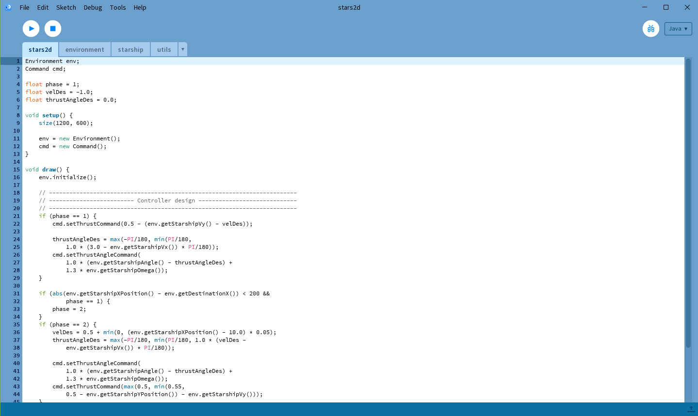
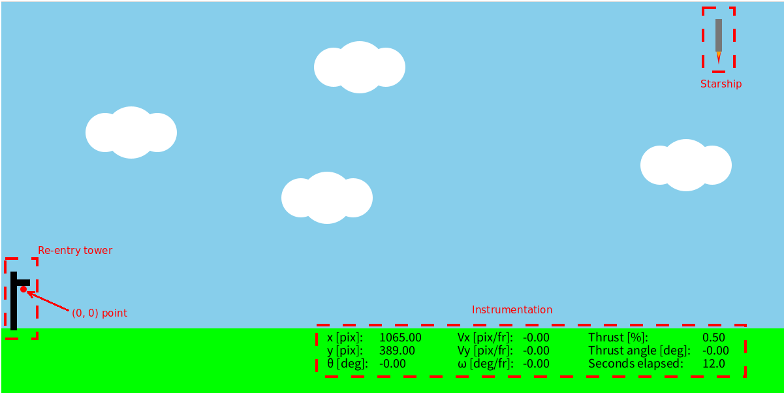
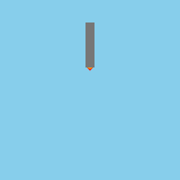
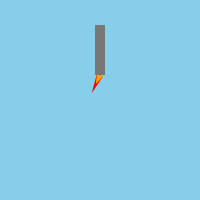
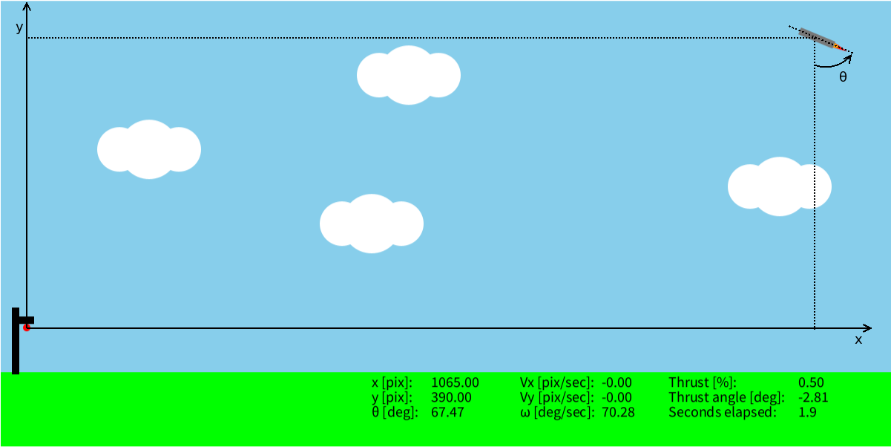

# Learn the basics of Control Engineering with StaRS 2D
## Lesson 1: Feedforward control

 

Welcome to the first lesson of "Learn the basics of Control
Engineering with StaRS 2D"!

 

 

Control engineering is becoming more and more important nowadays: just to
give you an idea, the design of
modern aircrafts, spaceships and autonomous cars widely relies on it.

But... what is control engineering? Well, this course aims at giving you
insights to answer this question by considering a current fascinating control
engineering application: <em>the Starship re-entry task</em>.

In this course, you will:
-   Learn how to design simple controllers using standard control
engineering techniques;
-   Use an educational 2D Starship Re-entry Simulator
([StaRS 2D](https://github.com/gsmfnc/StaRS2D)) in
[Processing](https://processing.org/) to see your controller in action!

---

Prerequisites:
1.  Some experience with coding
2.  Understanding of basic physics, mathematics and trigonometry

---

Outline of the lesson:
1.  [Installation](#installation)
2.  [Main script](#main-script)
3.  [Thrust vectoring](#thrust-vectoring)
4.  [Instrumentation](#instrumentation)
5.  [Forces and torques simplification](#forces-and-torques-simplification)
6.  [Rules](#rules)
7.  [Feedforward control design](#feedforward-control-design)

## Installation

To begin with, we need to install Processing to run StaRS 2D.
You can follow the instructions of this [link](https://processing.org/download)
to download the latest Processing software version.
However, the code was tested with an older versions (4.3, 4.4) that can be
downloaded
[here](https://github.com/processing/processing4/releases/tag/processing-1293-4.3).

To install StaRS 2D, just clone this
[github repository](https://github.com/gsmfnc/StaRS2D) and open
<em>stars2d.pde</em> with Processing (File -> Open... and select such a 
file wherever you cloned the repository).
Once you open <em>stars2d.pde</em>, the Processing window will look like this:
If you press run on the top left, you should see the animation above!

## Main script

<em>stars2d</em> is the main script that you should modify.
In order to not
compromise the functionality of the simulator, do not modify the other files
you see (i.e., <em>environment</em>, <em>starship</em> and <em>utils</em>).

In Processing, the setup() function is executed only once while the draw()
function is executed in loop.
For every loop, the code calls
env.initialize() that creates the graphics shown below.

1.  The initial position of the starship is at the top right;
2.  You can check several parameters of Starship at the bottom right through the
instrumentation;
3.  The "re-entry" tower is at the bottom left;
4.  The red circle beside the reentry tower represents the "zero" coordinate and
the destination point.

## Thrust vectoring

To give thrust vectoring inputs, StaRS 2D provides the following functions:

| Function | Description |
| :---------------- | :-------------------- |
| cmd.setThrustCommand(val) | Determines the thrust. 'val' must be between 0 and 1: negative values will be forced to 0, whereas values greater than 1 will be forced to 1. When the angle $\theta$ of Starship equals 0, a thrust command of 0.5 perfectly compensates gravity.|
| cmd.setThrustAngleCommand(val) | Determines the angle of thrust. It is limited to [-30,30] degrees, thus values outside this interval will be forced to either -30 (if val<-30) or 30 degrees (if val>30)|

Varying val in cmd.setThrustCommand(val) from 0 to 1, you will see the animation
of Starship changing like this:

Similarly, varying val in cmd.setThrustAngleCommand(val) from -30 to 30, you
will get:

## Instrumentation

The position and the attitude of Starship is expressed with respect to a
coordinate system that has its origin in the "landing point" of the re-entry 
tower (see figure below).
Starship's position is indicated with a pair $(x,y)$ of decimal values
representing the pixel [pix] that the center of Starship occupies.
The velocity along the axes $x$ and $y$ is denoted with $Vx$ and $Vy$.
It is expressed in pixel per second [pix/sec].
The attitude is represented by the angle $\theta$ and the associated angular
velocity is $\omega$.
These are expressed in degrees [deg] and degrees per seconds [deg/sec].

StaRS 2D provides the following functions to programmatically access the
information provided by the instrumentation:

| Function | Description |
| :---------------- | :-------------------- |
| env.getStarshipXPosition() | Returns x-coordinate of Starship's position|
| env.getStarshipYPosition() | Returns y-coordinate of Starship's position |
| env.getStarshipVx() | Returns x-coordinate of Starship's velocity |
| env.getStarshipVy() | Returns y-coordinate of Starship's velocity |
| env.getStarshipAngle() | Returns $\theta$ angle value |
| env.getStarshipOmega() | Returns angular velocity $\omega$ value |
| env.getElapsedTime() | Returns the elapsed time |

## Forces and torques simplification

In this lesson, forces and torques are simplified to velocities and angular
velocities so that the design of controllers is simpler.
So, gravity is a constant velocity pushing downwards.
When Starship is "upright", a thrust command of $0.5$ with
a zero thrust angle perfectly "defeats" gravity.

## Rules

You fail the re-entry mission if:
1.  You crash to the ground;
2.  You hit the launch tower;
3.  You land too quickly (velocity must be between -0.1 and 0.1 [pixel/seconds]
the moment you reach the landing point).

You succeed the descent and the landing if:
1.  You reach any point in the square defined by $x$ in $[-1,1]$ pixels and $y$
in the
same interval while having $\theta$ in $[-0.5,0.5]$ degrees, $\omega$ in
$[-0.1,0.1]$ degrees/seconds and both $Vx$ and
$Vy$ in $[-0.1,0.1]$ pixels/seconds.

# Feedforward control design
