# Learn the basics of Control Engineering with StaRS 2D
## Lesson 2: Proportional-Integral (PI) controller

<br>
<p align="center">
Welcome to the second lesson of "Learn the basics of Control
Engineering with StaRS 2D"!</p>
<br>

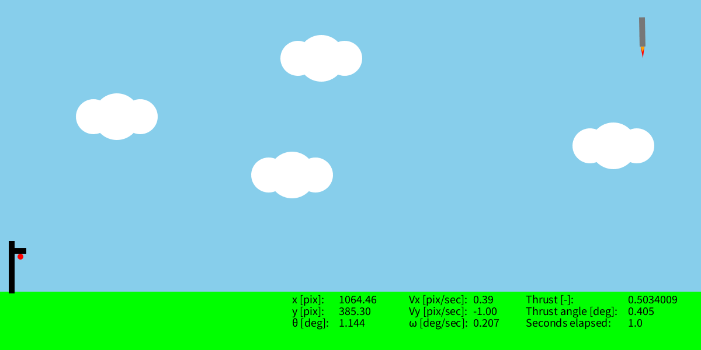

<br>

---

In the
[previous lesson](https://github.com/gsmfnc/StaRS2D_course/blob/main/lesson_01_basic_control/lesson_01_basic_control.md)
we managed to design our first flight controller to
successfully land Starship onto the re-entry tower.
In this lesson, we will point out some of the vulnerabilities of that controller
and we will show how to design controllers in a smarter way.

---

Outline of the lesson:
1.  [Unexpected events](#unexpected-events)
2.  [P (Proportional) controllers](#p-proportional-controllers)
3.  [PI (Proportional-Integral) controllers](#pi-proportional-integral-controllers)

## Unexpected events

In our first lesson we designed a flight controller based on the simulator at
our disposal.
However, there are many effects that are not included in such a simulator and
these may affect the result of Starship's re-entry task.
For example, suppose that there is a wind gust disturbing
Starship when its $y$-coordinate is higher than $300$ pixels.
We can enable this disturbance by adding the line env.setLevel(2) in
the setup function, as follows:

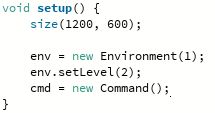

If we press Run now, you will notice Starship failing its re-entry task!
That's because our previous controller makes Starship rotate to get its
angle $\theta$ to $30$ degrees.
However, in case $\theta$ becomes larger than that value, there is no
mechanism to reduce it to $30$ degrees again.

We can fix this problem using a logic-based solution, where we not only give a
thrust angle command until $\theta$ reaches $30$ degrees but also another in
case it becomes too large.
One way to do this is to use a double if-statement as highlighted in the
following picture.

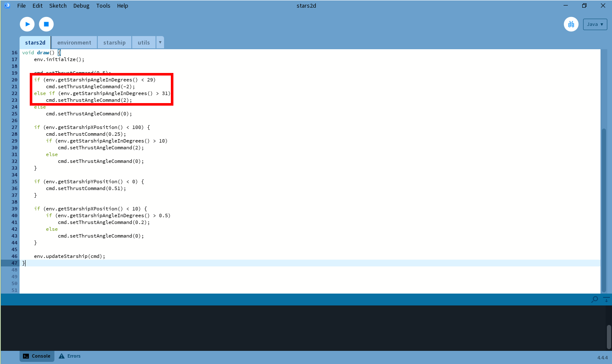

Basically, we will push Starship to an angle that is greater than $29$
degrees when $\theta$ is smaller than $29$ degrees.
Then, if $\theta$ gets larger than $31$ degrees, then we will give a thrust
angle command to bring it back to a value smaller than $31$ degrees.
Overall, $\theta$ will stay around $30$ degrees.
We should do the same also with the other if-statements to avoid that new
unexpected events compromise the mission.

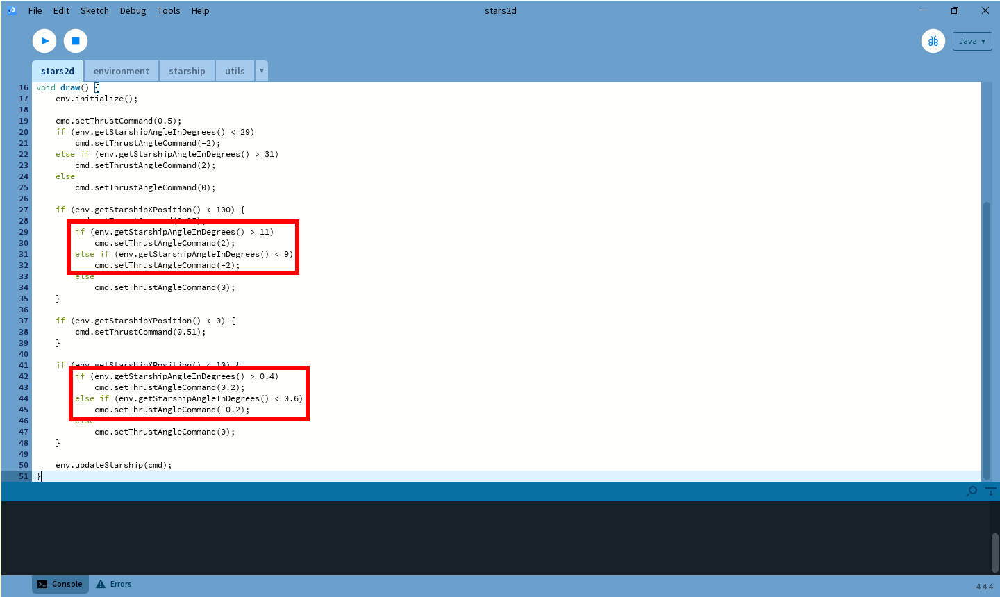

Running this new controller, it is possible to see that the thrust vectoring
is rather shaky at the beginning (i.e. while Starship is inside the wind gust
area).
As a matter of fact, we are constantly switching the thrust angle command among
three values: $-2$, $0$ and $2$ degrees.
That's not a very elegant solution, we would prefer to have the thrust angle
command to vary "continuously" rather than jumping from a value to another.

## P (Proportional) controllers

To avoid that shaky behaviour that we saw with the previous solution, we can
use proportional controllers.
These are very popular in control engineering and they consist of assigning a
control input that is proportional to the error with respect to the desired
value.

In our case, we want Starship to reach $30$ degrees at the beginning, so the
error will be the difference between $\theta$ and $30$ degrees, i.e.
$error=\theta-30$.
We could directly use this formula to assign a thrust angle command:

```
cmd.setThrustAngleCommand(env.getStarshipAngleInDegrees() - 30).
```

In such a way, the more $\theta$ is far from $30$, the larger the command will
be.
For example, when Starship has a $\theta$ angle of zero degrees, we will be
giving a $30$ degrees of thrust angle command.
On the other hand, when Starship comes close to $30$ degrees, let's say
$25$ degrees, the thrust angle command will be $5$ degrees.
Also, if for any reason Starship reaches an angle larger than $30$ degrees, say
$35$, then the thrust angle command will be $-5$ degrees, thus automatically
making it rotate to the opposite direction to reach again the desired angle.
Finally, only when Starship has reached exactly $30$ degrees we will be giving
a zero thrust angle command, hence enforcing no more rotation.

What is usually done is to multiply the error by some constant that we call
the proportional gain.
In our case, we will use a gain equal to $0.1$, so the thrust angle command
controller will be

```
cmd.setThrustAngleCommand(0.1 * (env.getStarshipAngleInDegrees() - 30)).
```

Choosing a smaller or a larger gain, will result in a slower or a faster
response of Starship to reach the desired angle.
In our code, we refer to the proportional gain as <em>anglePGain</em> that we
initialize to $0.1$ at the beginning.
Moreover, we will use a proportional controller also further in the code,
changing the desired angle appropriately.

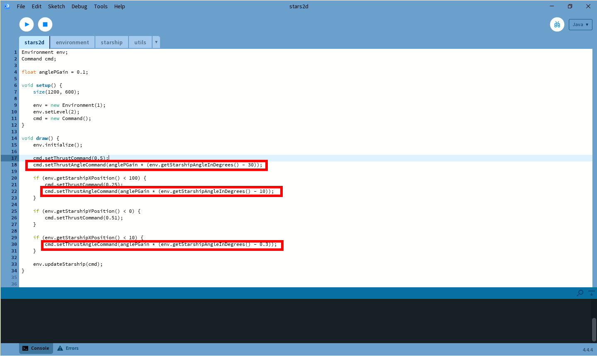

Running the simulator with this flight controller will show a smoother
thrust angle behaviour and a successfull re-entry mission!

---

**Exercise 1.**
Try to change anglePGain with smaller or larger values to see how
the overall behaviour of Starship changes.

---

## PI (Proportional-Integral) controllers

We have now used a proportional controller to determine thrust angle commands
to ensure that Starship reaches desired $\theta$ angles.
In control theory, we say that a controller with such a property is stabilizing
and $\theta$ converges to its desired value.

We could design a similar controller also for the thrust command, so that we can
ensure convergence of the vertical speed to some desired value.
Therefore, let's define a proportional controller for the thrust command as
well.
Say that our desired descent velocity for the first phase is $-0.14$ pix/sec,
then the error in this case would be $error=-0.14-V_y$.
Thus, we can define a proportional controller using the following command:

```
cmd.setThrustCommand(0.3 * (-0.14 - env.getStarshipVy()))
```

where we chose the proportional gain to be $0.3$.
We will refer to the thrust command proportional gain as <em>thrustPGain</em>
and thus implement the controller for the first phase of descent as shown in
the following figure.

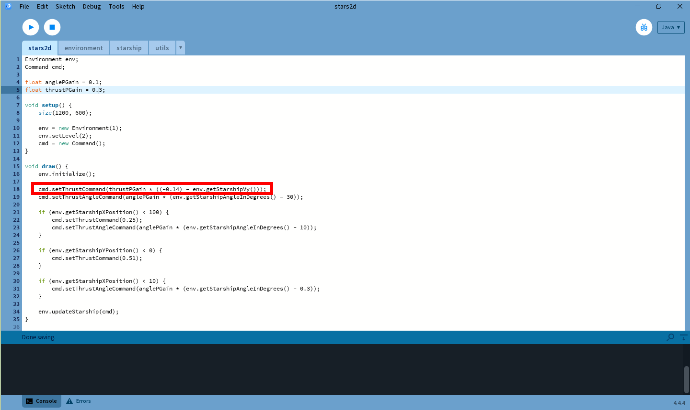

Running the simulation, we can observe through the instrumentation that Starship
does not actually reach the desired descent velocity.
This is a well-known problem with proportional controllers in particular cases.
We say that our controller converges to some value with a static error or does
not converge at all.

In our case of study, the reasoning behind this undesired behaviour is the
presence of gravity: the
proportional control law gives a thrust command of zero when $V_y=-0.14$ but,
as soon as it becomes zero, gravity will further reduce the velocity, generating
again an error that will be compensated by a non-zero thrust command.

---

**Exercise 2.**
Change the proportional gain <em>thrustPGain</em> to see that
larger values will lead to a shaky
thrust command that keeps the vertical speed $V_y$ shaking around the desired
one (no convergence),
whereas smaller values will not be able to keep
the velocity close to the desired one (convergence with a static error).

---

A classical solution to this problem is the addition of
an integral term, making it a proportional-integral controller.
Mathematically speaking, this means that we will assign the thrust command as

```math
thrust=0.3(-0.14 - V_y)+0.1\int_0^t(-0.14-V_y)dt
```

where $0.3$ is again the proportional gain and $0.1$ is the integral gain.

Computing the exact integral is usually not possible in practice, so we use the
fact that the integral can be approximated with the sum of all the errors up
until the current time.
To do so, we will have to introduce an auxiliary variable called
<em>thrustIError</em>
that is zero at the beginning and we will sum to it the current error for
every execution of the draw() function.
Also, we will call <em>thrustIGain</em> the integral gain.

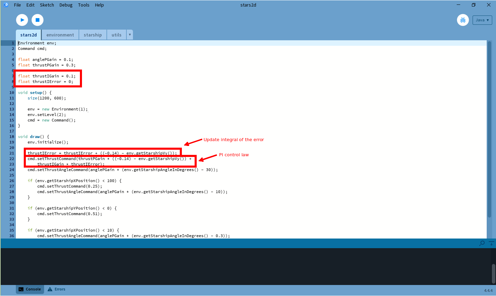

We can observe that convergence to the desired vertical speed is now achieved.
However, the code is now becoming a little complicated.
Let's re-organize it defining four phases of landing.

### Phase 1: Approach

This first phase consists of moving towards the re-entry tower.
To do so, we need to lose height and move towards Starship's left.

First, we define an auxiliary variable called <em>phase</em> that we will use to
determine in which of the four phases we currently are.

During this phase we use a PI controller for the thrust command so to have a
desired vertical velocity of $-0.14$ pix/sec.
Moreover, we use a P controller to keep an angle of $30$ degrees.

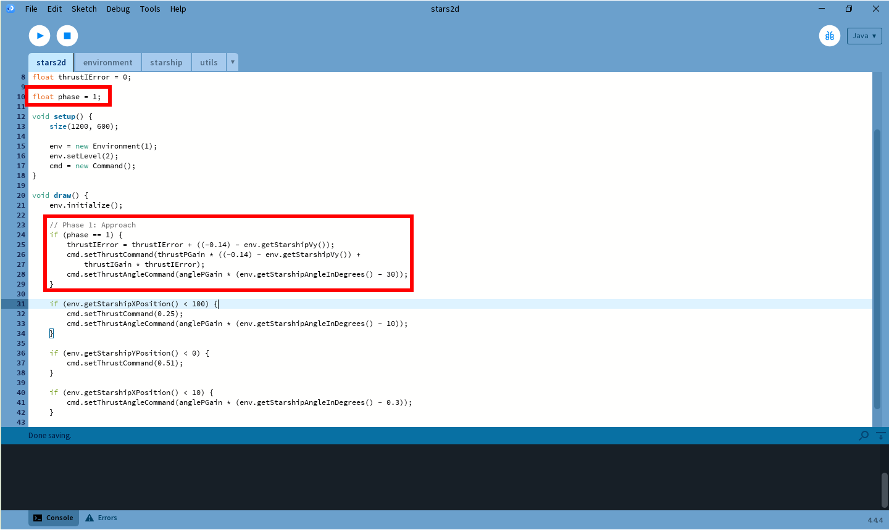

### Phase 2: Lose height 

This phase starts when the $x$-coordinate of Starship is below $100$ pixels.
Therefore, we set the variable <em>phase</em> equal to $2$ when such a condition
is verified together with <em>phase</em> itself being equal to $1$.
We do so to avoid that for some reason we go back to phase $2$ when we are in
phase $3$ or $4$ (even though, switch to a previous phase may be useful in case
of unexpected events...).

We will start losing height by reducing the desired vertical velocity to
$-0.5$ pix/sec.
Also, since we are getting closer to the re-entry tower, we start reducing
the horizontal velocity by reducing Starship's angle to $10$ degrees.

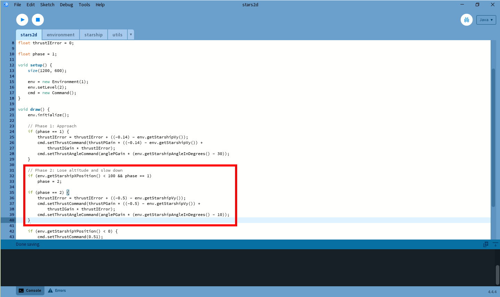

### Phase 3: Keep height and reduce angle

This phase start when we have lost sufficient height , that is when we
$y$-coordinate of Starship is equal to zero.

Having $y=0$ is ideal as it is the height of our landing point, so we want to
keep such a value.
Up until now, we defined the thrust command with respect to a desired velocity.
To keep doing that, we will define our desired velocity proportionally to our
desired $y$-coordinate.
For example, we can say that our desired velocity is $0.1(0-y)$, where $0.1$ is
the proportional gain.
In such a way, our desired velocity will be positive when the $y$-coordinate is
below 0 pixels and negative otherwise.
Also, the more the $y$-coordinate is "far" from $0$, the larger (positive or
negative) vertical speed we will demand.

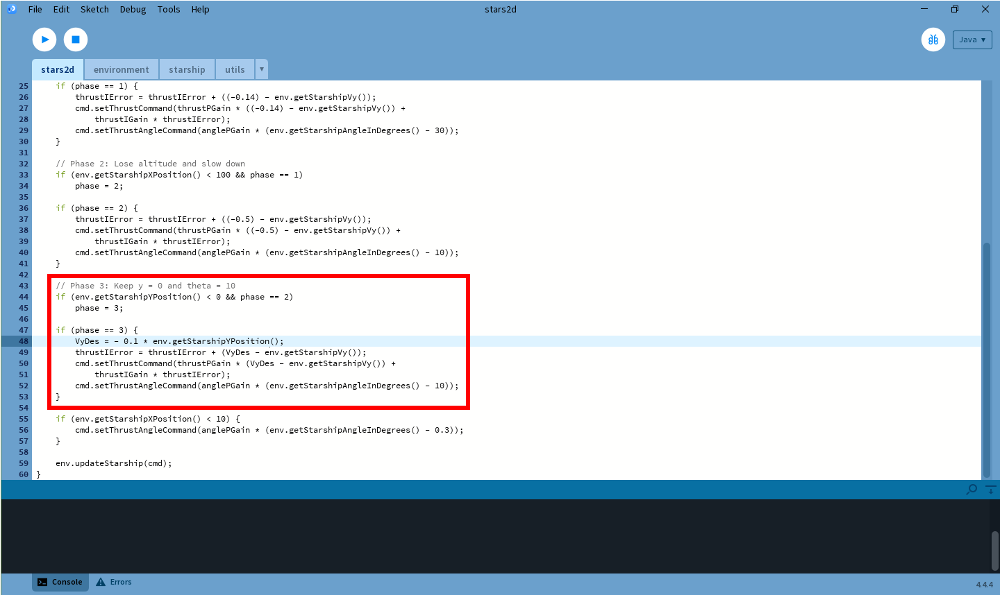

### Phase 4: Keep height and further reduce angle

This final phase starts when we are very close to the re-entry tower, hence
when the $x$-coordinate is below $10$ pixels.

The control objective is the same as before, we want to keep the height to
zero.
Moreover, we require an angle of $0.3$ degree so that the horizontal velocity
lies inside the requirements for a successfull landing.

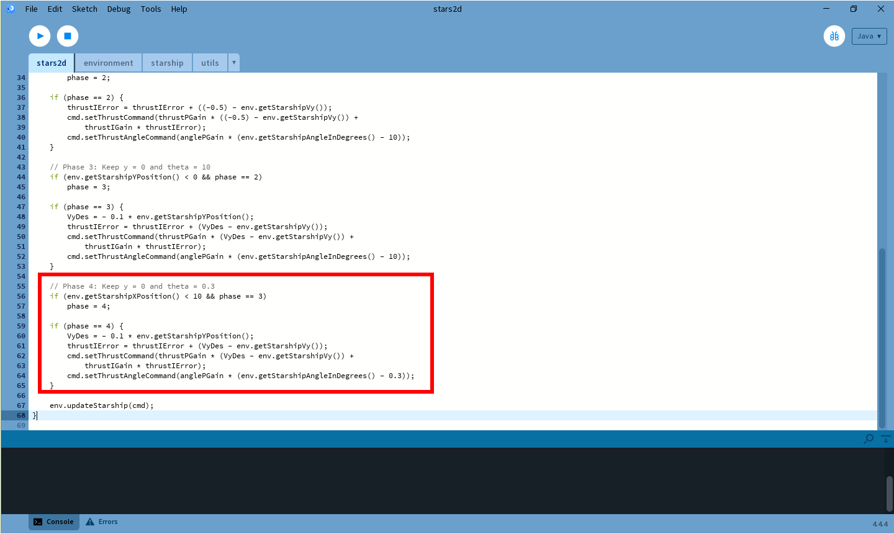

---

**Exercise 3.**
We have implement a thrust command controller based on desired vertical
velocities.
Try to implement a controller that is based on the $y$-position rather than
$V_y$.
In this case, you can ask to reach $y=0$ right from the beginning and then
just keep moving horizontally towards the re-entry tower.

**Exercise 4.**
The thrust angle command allows convergence to desired $\theta$ angles.
Try to define the desired $\theta$ based on a desired $x$-velocity.
In such a way, you have direct control of the horizontal speed of Starship.

**Exercise 5.**
Add an additional "emergency" phase that you activate as soon as you reach phase
$2$.
During the emergency phase, Starship needs to go back to $y=300$ pixels.
After doing so, you can finalize the landing.

---
